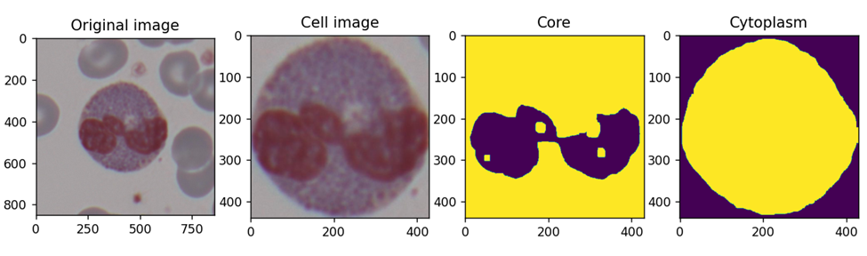
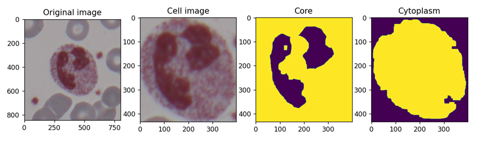

# Алгоритм сегментации белых кровяных клеток

Описание задачи
-----
В данной работе объектом исследования являются белые клетки крови. 

Прежде чем разобраться в необходимости решения данной задачи нам следует дать ответы на вопросы: что такое кровь и что такое 
белые клетки крови (лейкоциты). Как это все связано с анализом крови и световой микроскоп. 

Кровь — жидкая и подвижная соединительная ткань внутренней среды организма.
Состоит из жидкой среды — плазмы — и взвешенных в ней форменных элементов (клеток и производных от клеток): 
эритроцитов, лейкоцитов и тромбоцитов.

Лейкоци́ты  они же белые клетки крови — неоднородная группа различных по внешнему виду и функциям клеток крови 
человека и животных, выделенная по признакам наличия ядра и отсутствия самостоятельной окраски.

Ана́лиз кро́ви — лабораторное исследование крови, являющееся одним из основных методов определения общего 
состояния организма и помогающий в диагностике огромного количества заболеваний. 
Его делают также и здоровым людям в профилактических целях.

Оптический или световой микроско́п  — оптический прибор для получения увеличенных изображений объектов (или деталей их структуры), 
невидимых невооружённым глазом.

Как мы уже поняли из терминологии кровь это субстанция которая циркулирует в организме человека. 
Внутри крови есть клетки например лейкоциты и они защищают организм. 
А анализ крови это лабораторное исследование лейкоцитов и прочих клеток внутри крови. 

Для того чтобы провести анализ крови. Берется кровь из капилляров или вены человека. 
Затем окрашивается (чаще всего по Романовскому - Гимзе) и наносится на обезжиренное предметное стекло.
Данное стекло содержащее на себе кровь называется "мазком крови"
 

Затем с использованием светового микроскопа можно произвести анализ мазка крови. 
В процессе анализа при использовании различных увеличений проводится подсчет лейкоцитов итд. 
Наша работа направлена на автоматическое обнаружение лейкоцитов в поле зрении светового микроскопа и
также сегментацию ядра и цитоплазмы обнаруженных клеток. Данная работа облегчает подсчет лейкоцитарной формулы (желающие могут загуглить).
И определению марфологических свойств клеток. 

Описания данных:
-----
В качестве объекта анализа мы имеем  цветное изображения различных типов лейкоцитов. Отснятых при использовании микроскопа
под увеличением 40х. 

План работы:
-----
1. Загрузка изображения и обработка изображения
2. Находим все темные пиксели. Так как эритроциты и background имеют светлый оттенок по сравнению с лейкоцитами. Тем самым создаем маску 
3. На маске находим объект имеющий наибольшую площадь. Это и есть наш лейкоцит. 
4. Имя изображения лейкоцитами используя метода кластеризации находим цитоплазму и ядро или ядра клетки. 
5. Выводим на экран исходное изображение , изображение клетки , ядра и цитоплазмы

Вывод:
----

В результате данный работы получаем алгоритм сегментации белых кровяных клеток.  Так же имея данный 
о клетках можно провести подсчет: радиус, количество ядер, размер ядра и цитоплазны итд.
Затем полученные морфологические свойства клетки можно использовать в обучении алгоритма классификации клеток. 